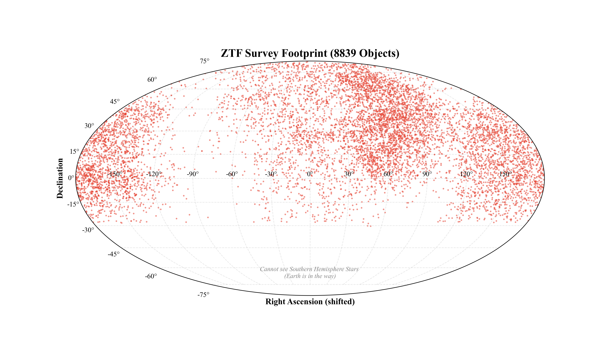

# Team

## Name: Yuthi Madireddy

## Data Source

What data source did you work with?

 Worked with the ALeRCE client library, which is a broker for astronomical alert streams. ALeRCE provides a method of interaction for other services and databases, which allows users to query for objects and classifications. For this project, I initialized the client to connect to the Zwicky Transient Facility (ZTF) API, which is a robotic astronomical survey based in California. The ZTF uses a large camera to scan for objects in the sky such as supernovae, asteroids, and other real-time astronomical events. Connected to the API to collect over 100,000 detection records of supernovae and variable stars to analyze the temporal behavior (light curves) and spatial distribution of these astronomical events. 

## Challenges / Obstacles

What challenges did this data choice present in data gathering, processing and analysis, and how did you work through them? What methods and tools did you use to work with this data?

- **Object Observation vs Detections**: The main challenge was distinguishing between unique astronomical objects and their multiple detections over time. Each object can have numerous observations, leading to a complex dataset. To address this, I structured the database to separate object metadata from detection records, ensuring clarity in data relationships.

- **Idempotency**: Another key challenge was ensuring that we could stop and restart the data gathering process without duplicating records. To address this, I utilized the 'INSERT OR IGNORE' command in SQLite to prevent duplicate entries based on unique constraints such as the object ID and detection timestamp.

## Analysis
By mapping the right ascension (RA) and the declination (Dec) from the collected observations, I was able to visualize the physical span of the telescope's survey area. The analysis revealed that the ZTF survey covers a significant portion of the northern sky, with a dense concentration of observations in specific regions. As a result the observations recorded are not reflective of the actual distribution of astronomical objects in the universe, but rather the areas where the telescope was directed. This highlights the importance of understanding observational biases when interpreting astronomical data.

## Plot / Visualization

Here we have a graph of a light curve for the supernova ZTF24aaaisai. We can see that the initial point is relatively dim but indicative of an explosion starting (indicated by the green filter dot). The green references to the filter used during the observation, which in this case is the 'g' filter (green light). Different filters can provide insights into various aspects of the supernova's behavior and properties. Green indicates that the observations are higher in energy compared to its red counterpart. We see that the first point is relatively dim but then the following observations begin climbing, meaning that the explosion is getting brighter and releasing more energy. The supernova peaks at a brightness of -19.15. Then, the line begins decreasing consistently ending around a magnitude of -19.42, demonstrating that the star is cooling down and getting dimmer as the ejected material expands and cools. 

## GitHub Repository

https://github.com/yuthimreddy/DP3_Findings-Workspace

[def]: image.png